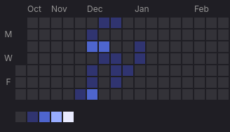
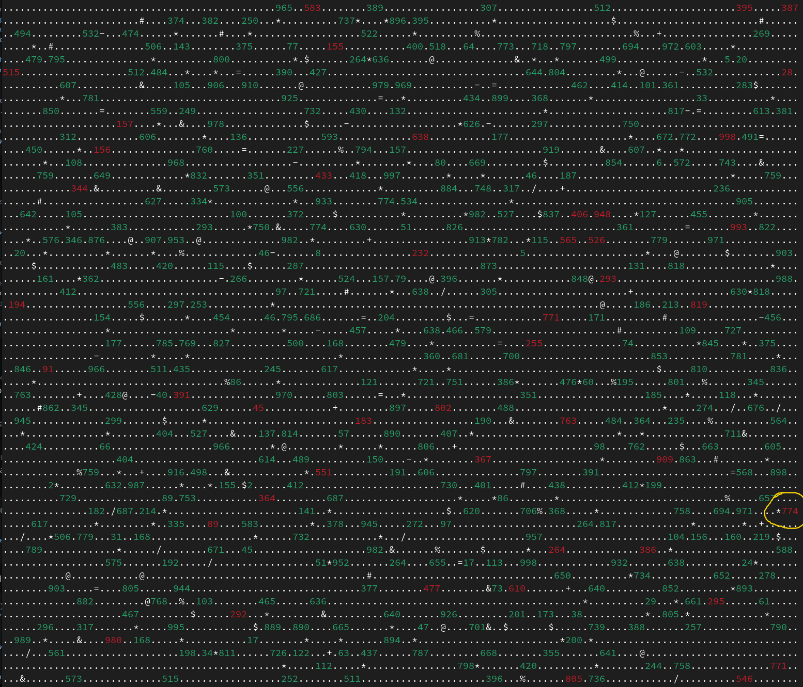

= Advent of code 2023

Same procedure as every year, Eric.

 Advent of code 2023

image:https://godoc.org/gitlab.com/jhinrichsen/adventofcode2023?status.svg["godoc", link="https://godoc.org/gitlab.com/jhinrichsen/adventofcode2023"]
image:https://goreportcard.com/badge/gitlab.com/jhinrichsen/adventofcode2023["Go report card", link="https://goreportcard.com/report/gitlab.com/jhinrichsen/adventofcode2023"]
image:https://gitlab.com/jhinrichsen/adventofcode2023/badges/main/pipeline.svg[link="https://gitlab.com/jhinrichsen/adventofcode2023/-/commits/main",title="pipeline status"]
image:https://gitlab.com/jhinrichsen/adventofcode2023/badges/main/coverage.svg[link="https://gitlab.com/jhinrichsen/adventofcode2023/badges/main/coverage.svg",title="coverage report"]

[quote, me]
Same procedure as every year, Eric.

My take on https://adventofcode.com/2023/ in Go. As usual, i don't particularly
care if i provide my solutions _fast_, i try to be _correct_ on the first
answer, and care for being runtime efficient.
All puzzles are backed by unit testing the examples and the puzzles.
Results are hard coded into the unit tests, so you might not want to peek at `_test.go` files.

== Environment

- Go 1.22
- vim, vim-go, gopls, fed by an HHKB
- VisualStudio Code for debugging
- Fedora 38, 39, 40 @ Framework 16" (AMD Ryzen 7 7840HS w/ Radeon 780M Graphics)
- Fedora 38, 39, 40 @ AMD Ryzen 5 3400G on a Gigabyte B450
- OSX @ 16" Macbook Pro 2019 (Intel(R) Core(TM) i9-9980HK CPU @ 2.40GHz)

I'd love to try one of those Risc-V boards but can't decide between
https://github.com/openwch/ch32v003[a bare metal 48 MHz]
- probably requiring tinygo - or a full fledge
https://www.sifive.com/cores/performance-p870-p870a[multicore GHz monster].

== Project structure

Each day lives separately in a `day{{.n}}.go` and `day{{.n}}_test.go` file.
Unit test data, both examples and puzzle input, is in
`testdata/day{{.n}}.txt`, and `testdata/day{{.n}}_example.txt`.

== Overview

Number of tries for a correct answer:

|===
| Day | part 1 | part 2
| 1   |   1    |  3
| 2   |   1    |  1
| 3   |   3    |  2
| 4   |   1    |  1
| 5   |   1    |
| 6   |   1    |  1
| 7   |   1    |  2
| 8   |   1    |
| 9   |        |
| 10  |        |
| 11  |        |
| 12  |        |
| 13  |        |
| 14  |        |
| 15  |        |
| 16  |        |
| 17  |        |
| 18  |        |
| 19  |        |
| 20  |        |
| 21  |        |
| 22  |        |
| 23  |        |
| 24  |        |
| 25  |        |
|===

== Day 1 Trebuchet?!

Writing a custom one-pass parser for V2 because why not.
----
goos: darwin
goarch: amd64
pkg: adventofcode2023
cpu: Intel(R) Core(TM) i9-9980HK CPU @ 2.40GHz
BenchmarkDay01V1
BenchmarkDay01V1-16       	    5516	    214078 ns/op	    5006 B/op	    2207 allocs/op
BenchmarkDay01V2
BenchmarkDay01V2-16       	   21414	     55737 ns/op	       0 B/op	       0 allocs/op
BenchmarkDay01Large
BenchmarkDay01Large-16    	     462	   2582112 ns/op	       0 B/op	       0 allocs/op
PASS
ok  	adventofcode2023	4.568s
----
Solving part 1 takes 55 μs.

== Day 3 Gear Ratios

Looks like a flood fill, aka seed fill.
Doing my homework on the internet, lots of recursive solutions.
I personally avoid recursion, because it will blow up in your face,
right when the beeper goes on alert in the middle of deep sleep.

https://github.com/erich666/GraphicsGems/blob/master/gems/SeedFill.c[Heckbert]
has a solid looking implementation as part of his "Graphic Gems" Series in part 1, `A SEED FILL ALGORITHM`.
This one is also referenced by Wikipedia as `Span Filling`.

https://lodev.org/cgtutor/floodfill.html[Lode Vandevenne] has an interesting looking `Scanline Floodfill Algorithm With Stack (floodFillScanlineStack)`.

Then there's Windows C++ Code by https://www.codeproject.com/Articles/6017/QuickFill-An-efficient-flood-fill-algorithm[John R Shaw].

http://unity3dmc.blogspot.com/2017/02/ultimate-3d-floodfill-scanline.html[This] one claims to be 1000 times faster than anything else, but looks kinda weird.

https://en.wikipedia.org/wiki/Flood_fill#Walk-based_filling_(Fixed-memory_method)[Wikipedia] describes an O(1) memory `Walk-based filling (Fixed-memory method)`, but it is only valid for 4-connected, and we need 8-connected because diagonals count as well.

A version from 2007 named `A Linear-Time Constant-Space Algorithm for the Boundary Fill Problem` looks very efficient.
The pseudo-code provided is a real pseudo, as in

----
next.blockednodes:={u|dist(u,next)==1 && u.color!=black}
----

The newest publication i found is https://arxiv.org/abs/1906.03366[Scan-flood Fill(SCAFF): an Efficient Automatic Precise Region Filling Algorithm for Complicated Regions] by Yixuan He, Tianyi Hu, Delu Zeng.
It mentions large scale auto-learning.

But then we would have to XOR the whole thing because we need those numbers that are reachable, not islands.
Thinking again, KISS to the rescue. Just parse numbers, and check if the C8 environment contains any special characters.

It took me three turns to make the algorithm work. Yes, numbers can end directly at the end of the line.

=== Power Mode 'Balanced'

----
goos: linux
goarch: amd64
pkg: gitlab.com/jhinrichsen/adventofcode2023
cpu: AMD Ryzen 7 7840HS w/ Radeon 780M Graphics
BenchmarkDay03Part1-16    	   19702	     57430 ns/op	       0 B/op	       0 allocs/op
BenchmarkDay03Part1-16    	   41658	     32092 ns/op	       0 B/op	       0 allocs/op
BenchmarkDay03Part1-16    	   41925	     28282 ns/op	       0 B/op	       0 allocs/op
BenchmarkDay03Part1-16    	   42114	     29990 ns/op	       0 B/op	       0 allocs/op
BenchmarkDay03Part1-16    	   38536	     28438 ns/op	       0 B/op	       0 allocs/op
PASS
ok  	gitlab.com/jhinrichsen/adventofcode2023	7.829s
----

=== Power Mode 'Power Saver'

----
goos: linux
goarch: amd64
pkg: gitlab.com/jhinrichsen/adventofcode2023
cpu: AMD Ryzen 7 7840HS w/ Radeon 780M Graphics
BenchmarkDay03Part1-16    	   10586	    111056 ns/op	       0 B/op	       0 allocs/op
BenchmarkDay03Part1-16    	   10000	    101209 ns/op	       0 B/op	       0 allocs/op
BenchmarkDay03Part1-16    	   10000	    112834 ns/op	       0 B/op	       0 allocs/op
BenchmarkDay03Part1-16    	   10000	    115926 ns/op	       0 B/op	       0 allocs/op
BenchmarkDay03Part1-16    	   10000	    101594 ns/op	       0 B/op	       0 allocs/op
PASS
ok  	gitlab.com/jhinrichsen/adventofcode2023	6.504s
----

=== Power Mode 'Performance'

----
goos: linux
goarch: amd64
pkg: gitlab.com/jhinrichsen/adventofcode2023
cpu: AMD Ryzen 7 7840HS w/ Radeon 780M Graphics
BenchmarkDay03Part1-16    	   42468	     30711 ns/op	       0 B/op	       0 allocs/op
BenchmarkDay03Part1-16    	   38066	     30958 ns/op	       0 B/op	       0 allocs/op
BenchmarkDay03Part1-16    	   42180	     28016 ns/op	       0 B/op	       0 allocs/op
BenchmarkDay03Part1-16    	   37698	     31678 ns/op	       0 B/op	       0 allocs/op
BenchmarkDay03Part1-16    	   41976	     30219 ns/op	       0 B/op	       0 allocs/op
PASS
ok  	gitlab.com/jhinrichsen/adventofcode2023	7.645s
----

=== Part 2

----
goos: linux
goarch: amd64
pkg: gitlab.com/jhinrichsen/adventofcode2023
cpu: AMD Ryzen 7 7840HS w/ Radeon 780M Graphics
BenchmarkDay03Part2-16             74426             15353 ns/op               0 B/op          0 allocs/op
BenchmarkDay03Part2-16             78756             15988 ns/op               0 B/op          0 allocs/op
BenchmarkDay03Part2-16             77714             15708 ns/op               0 B/op          0 allocs/op
BenchmarkDay03Part2-16             72922             15024 ns/op               0 B/op          0 allocs/op
BenchmarkDay03Part2-16             77499             15244 ns/op               0 B/op          0 allocs/op
BenchmarkDay03Part2-16             74164             16153 ns/op               0 B/op          0 allocs/op
BenchmarkDay03Part2-16             74095             15557 ns/op               0 B/op          0 allocs/op
BenchmarkDay03Part2-16             77061             15753 ns/op               0 B/op          0 allocs/op
BenchmarkDay03Part2-16             74888             15874 ns/op               0 B/op          0 allocs/op
BenchmarkDay03Part2-16             71414             16128 ns/op               0 B/op          0 allocs/op
----

----
goos: darwin
goarch: amd64
pkg: gitlab.com/jhinrichsen/adventofcode2023
cpu: Intel(R) Core(TM) i9-9980HK CPU @ 2.40GHz
BenchmarkDay03Part2-16    	   34120	     35665 ns/op	       0 B/op	       0 allocs/op
BenchmarkDay03Part2-16    	   35691	     33231 ns/op	       0 B/op	       0 allocs/op
BenchmarkDay03Part2-16    	   36195	     33311 ns/op	       0 B/op	       0 allocs/op
BenchmarkDay03Part2-16    	   35734	     35594 ns/op	       0 B/op	       0 allocs/op
BenchmarkDay03Part2-16    	   35541	     33427 ns/op	       0 B/op	       0 allocs/op
BenchmarkDay03Part2-16    	   35611	     33519 ns/op	       0 B/op	       0 allocs/op
BenchmarkDay03Part2-16    	   35823	     34799 ns/op	       0 B/op	       0 allocs/op
BenchmarkDay03Part2-16    	   33032	     33603 ns/op	       0 B/op	       0 allocs/op
BenchmarkDay03Part2-16    	   36066	     33785 ns/op	       0 B/op	       0 allocs/op
BenchmarkDay03Part2-16    	   35368	     33881 ns/op	       0 B/op	       0 allocs/op
----

----
goos: linux
goarch: amd64
pkg: gitlab.com/jhinrichsen/adventofcode2023
cpu: AMD Ryzen 5 3400G with Radeon Vega Graphics
BenchmarkDay03Part2-8   	   29594	     39583 ns/op	       0 B/op	       0 allocs/op
BenchmarkDay03Part2-8   	   30244	     39643 ns/op	       0 B/op	       0 allocs/op
BenchmarkDay03Part2-8   	   31123	     40310 ns/op	       0 B/op	       0 allocs/op
BenchmarkDay03Part2-8   	   27504	     38278 ns/op	       0 B/op	       0 allocs/op
BenchmarkDay03Part2-8   	   26856	     40871 ns/op	       0 B/op	       0 allocs/op
BenchmarkDay03Part2-8   	   28608	     39918 ns/op	       0 B/op	       0 allocs/op
BenchmarkDay03Part2-8   	   28083	     40723 ns/op	       0 B/op	       0 allocs/op
BenchmarkDay03Part2-8   	   28372	     40097 ns/op	       0 B/op	       0 allocs/op
BenchmarkDay03Part2-8   	   27661	     40784 ns/op	       0 B/op	       0 allocs/op
BenchmarkDay03Part2-8   	   30015	     41826 ns/op	       0 B/op	       0 allocs/op
----

== Day 4 Scratchcards

== Day 5 If You Give A Seed A Fertilizer

----
goos: linux
goarch: amd64
pkg: gitlab.com/jhinrichsen/adventofcode2023
cpu: AMD Ryzen 7 7840HS w/ Radeon 780M Graphics
BenchmarkDay05Part1-16    	   33780	     35607 ns/op	   41464 B/op	     978 allocs/op
----

== Day 6 Wait For It

Part 2 ran without any code changes.
Not sure what the challenge is for part 2.

----
goos: linux
goarch: amd64
pkg: gitlab.com/jhinrichsen/adventofcode2023
cpu: AMD Ryzen 5 3400G with Radeon Vega Graphics
BenchmarkDay06Part1-8   	 5116702	       205.3 ns/op
BenchmarkDay06Part2-8   	      37	  31458602   ns/op
PASS
----

That's just 31 ms.

== Day 7 Camel Cards

----
goos: linux
goarch: amd64
pkg: gitlab.com/jhinrichsen/adventofcode2023
cpu: AMD Ryzen 7 7840HS w/ Radeon 780M Graphics
BenchmarkDay07Part1-16    	     494	   2360739 ns/op
PASS
----

For part 2, i was promoting `OnePair` and a Joker to `TwoPairs` instead of `ThreeOfAKind`. Damn.

----
goos: linux
goarch: amd64
pkg: gitlab.com/jhinrichsen/adventofcode2023
cpu: AMD Ryzen 5 3400G with Radeon Vega Graphics
BenchmarkDay07Part1-8   	     220	   4891596 ns/op	   72576 B/op	    1001 allocs/op
BenchmarkDay07Part2-8   	     222	   5629774 ns/op	   72576 B/op	    1001 allocs/op
PASS
----

To get rid of the memory allocation, pack cards and their bid into a struct, so it is not required to backreference the bid after ranking.

----
goos: linux
goarch: amd64
pkg: gitlab.com/jhinrichsen/adventofcode2023
cpu: AMD Ryzen 5 3400G with Radeon Vega Graphics
BenchmarkDay07Part1-8   	    5211	    222719 ns/op	       0 B/op	       0 allocs/op
BenchmarkDay07Part2-8   	    4837	    233281 ns/op	       0 B/op	       0 allocs/op
PASS
----

Thats 230 μs, and no memory allocation.

== Haunted Wasteland

A straight forward puzzle to implement, no algorithm background required.

----
goos: linux
goarch: amd64
pkg: gitlab.com/jhinrichsen/adventofcode2023
cpu: AMD Ryzen 5 3400G with Radeon Vega Graphics
BenchmarkDay08Part1-8   	    1884	    554004 ns/op	       0 B/op	       0 allocs/op
PASS
----

Part 2 contains a twitch in the particular input, which makes it possible to use an abbreviation.
Brute force approach will never terminate.
I peeked into some hints when my implementation ran longer than 10s, and decided to not apply the shortcut because it makes the solution totally dependent on input data.
