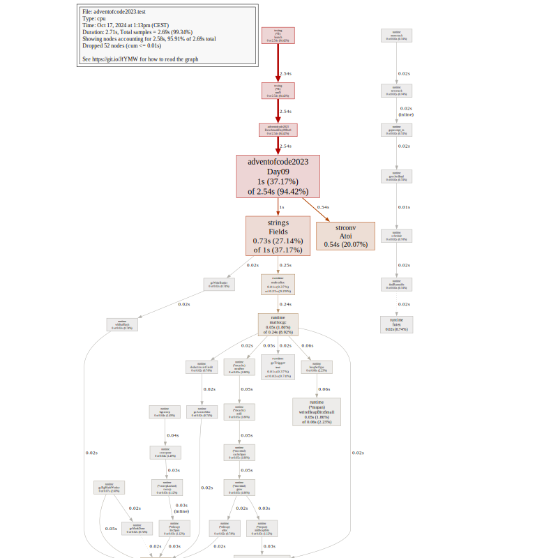

= Advent of code 2023

image:https://godoc.org/gitlab.com/jhinrichsen/adventofcode2023?status.svg["godoc", link="https://godoc.org/gitlab.com/jhinrichsen/adventofcode2023"]
image:https://goreportcard.com/badge/gitlab.com/jhinrichsen/adventofcode2023["Go report card", link="https://goreportcard.com/report/gitlab.com/jhinrichsen/adventofcode2023"]
image:https://gitlab.com/jhinrichsen/adventofcode2023/badges/main/pipeline.svg[link="https://gitlab.com/jhinrichsen/adventofcode2023/-/commits/main",title="pipeline status"]
image:https://gitlab.com/jhinrichsen/adventofcode2023/badges/main/coverage.svg[link="https://gitlab.com/jhinrichsen/adventofcode2023/badges/main/coverage.svg",title="coverage report"]

[quote, me]
Same procedure as every year, Eric.

My take on https://adventofcode.com/2023/ in Go. As usual, i don't particularly
care if i provide my solutions _fast_, i try to be _correct_ on the first
answer, and care for being runtime efficient.
All puzzles are backed by unit testing the examples and the puzzles.
Results are hard coded into the unit tests, so you might not want to peek at `_test.go` files.

== Environment

- Go 1.22, 1.23
- vim, vim-go, gopls, fed by an HHKB
- VisualStudio Code for debugging
- Fedora up to 41 @ Framework 16" (AMD Ryzen 7 7840HS w/ Radeon 780M Graphics)
- Fedora up to 41 @ custom build (AMD Ryzen 5 3400G on a Gigabyte B450)
- OSX @ 16" Macbook Pro 2019 (Intel(R) Core(TM) i9-9980HK CPU @ 2.40GHz)
- Prompts: Tabnine, ChatGPT, Gemini

I'd love to try one of those Risc-V boards but can't decide between
https://github.com/openwch/ch32v003[a bare metal 48 MHz]
- probably requiring tinygo - or a full fledge
https://www.sifive.com/cores/performance-p870-p870a[multicore GHz monster].

== Project structure

Each day lives separately in a `day{{.n}}.go` and `day{{.n}}_test.go` file.
Unit test data, both examples and puzzle input, is in
`testdata/day{{.n}}.txt`, and `testdata/day{{.n}}_example.txt`.

== Overview

Number of tries for a correct answer:

|===
| Day | Part 1 | Part 2
| 1   |   1    |  3
| 2   |   1    |  1
| 3   |   3    |  2
| 4   |   1    |  1
| 5   |   1    |
| 6   |   1    |  1
| 7   |   1    |  2
| 8   |   1    |
| 9   |   1    |  1
| 10  |   1    |
| 11  |   1    |
| 12  |        |
| 13  |        |
| 14  |        |
| 15  |        |
| 16  |        |
| 17  |        |
| 18  |        |
| 19  |        |
| 20  |        |
| 21  |        |
| 22  |        |
| 23  |        |
| 24  |        |
| 25  |        |
|===

== Day 1 Trebuchet?!

Writing a custom one-pass parser for V2 because why not.

----
goos: darwin
goarch: amd64
pkg: adventofcode2023
cpu: Intel(R) Core(TM) i9-9980HK CPU @ 2.40GHz
BenchmarkDay01V1
BenchmarkDay01V1-16       	    5516	    214078 ns/op	    5006 B/op	    2207 allocs/op
BenchmarkDay01V2
BenchmarkDay01V2-16       	   21414	     55737 ns/op	       0 B/op	       0 allocs/op
BenchmarkDay01Large
BenchmarkDay01Large-16    	     462	   2582112 ns/op	       0 B/op	       0 allocs/op
----
Solving part 1 takes 55 μs.

== Day 3 Gear Ratios

Looks like a flood fill, aka seed fill.
Doing my homework on the internet, lots of recursive solutions.
I personally avoid recursion, because it will blow up in your face,
right when the beeper goes on alert in the middle of deep sleep.

https://github.com/erich666/GraphicsGems/blob/master/gems/SeedFill.c[Heckbert]
has a solid looking implementation as part of his "Graphic Gems" Series in part 1, `A SEED FILL ALGORITHM`.
This one is also referenced by Wikipedia as `Span Filling`.

https://lodev.org/cgtutor/floodfill.html[Lode Vandevenne] has an interesting looking `Scanline Floodfill Algorithm With Stack (floodFillScanlineStack)`.

Then there's Windows C++ Code by https://www.codeproject.com/Articles/6017/QuickFill-An-efficient-flood-fill-algorithm[John R Shaw].

http://unity3dmc.blogspot.com/2017/02/ultimate-3d-floodfill-scanline.html[This] one claims to be 1000 times faster than anything else, but looks kinda weird.

https://en.wikipedia.org/wiki/Flood_fill#Walk-based_filling_(Fixed-memory_method)[Wikipedia] describes an O(1) memory `Walk-based filling (Fixed-memory method)`, but it is only valid for 4-connected, and we need 8-connected because diagonals count as well.

A version from 2007 named `A Linear-Time Constant-Space Algorithm for the Boundary Fill Problem` looks very efficient.
The pseudo-code provided is a real pseudo, as in

----
next.blockednodes:={u|dist(u,next)==1 && u.color!=black}
----

The newest publication i found is https://arxiv.org/abs/1906.03366[Scan-flood Fill(SCAFF): an Efficient Automatic Precise Region Filling Algorithm for Complicated Regions] by Yixuan He, Tianyi Hu, Delu Zeng.
It mentions large scale auto-learning.

But then we would have to XOR the whole thing because we need those numbers that are reachable, not islands.
Thinking again, KISS to the rescue. Just parse numbers, and check if the C8 environment contains any special characters.

It took me three turns to make the algorithm work. Yes, numbers can end directly at the end of the line.

image::img/day03.png[]

=== Power Mode 'Balanced'

----
goos: linux
goarch: amd64
pkg: gitlab.com/jhinrichsen/adventofcode2023
cpu: AMD Ryzen 7 7840HS w/ Radeon 780M Graphics
BenchmarkDay03Part1-16    	   19702	     57430 ns/op	       0 B/op	       0 allocs/op
BenchmarkDay03Part1-16    	   41658	     32092 ns/op	       0 B/op	       0 allocs/op
BenchmarkDay03Part1-16    	   41925	     28282 ns/op	       0 B/op	       0 allocs/op
BenchmarkDay03Part1-16    	   42114	     29990 ns/op	       0 B/op	       0 allocs/op
BenchmarkDay03Part1-16    	   38536	     28438 ns/op	       0 B/op	       0 allocs/op
----

=== Power Mode 'Power Saver'

----
goos: linux
goarch: amd64
pkg: gitlab.com/jhinrichsen/adventofcode2023
cpu: AMD Ryzen 7 7840HS w/ Radeon 780M Graphics
BenchmarkDay03Part1-16    	   10586	    111056 ns/op	       0 B/op	       0 allocs/op
BenchmarkDay03Part1-16    	   10000	    101209 ns/op	       0 B/op	       0 allocs/op
BenchmarkDay03Part1-16    	   10000	    112834 ns/op	       0 B/op	       0 allocs/op
BenchmarkDay03Part1-16    	   10000	    115926 ns/op	       0 B/op	       0 allocs/op
BenchmarkDay03Part1-16    	   10000	    101594 ns/op	       0 B/op	       0 allocs/op
----

=== Power Mode 'Performance'

----
goos: linux
goarch: amd64
pkg: gitlab.com/jhinrichsen/adventofcode2023
cpu: AMD Ryzen 7 7840HS w/ Radeon 780M Graphics
BenchmarkDay03Part1-16    	   42468	     30711 ns/op	       0 B/op	       0 allocs/op
BenchmarkDay03Part1-16    	   38066	     30958 ns/op	       0 B/op	       0 allocs/op
BenchmarkDay03Part1-16    	   42180	     28016 ns/op	       0 B/op	       0 allocs/op
BenchmarkDay03Part1-16    	   37698	     31678 ns/op	       0 B/op	       0 allocs/op
BenchmarkDay03Part1-16    	   41976	     30219 ns/op	       0 B/op	       0 allocs/op
----

=== Part 2

----
goos: linux
goarch: amd64
pkg: gitlab.com/jhinrichsen/adventofcode2023
cpu: AMD Ryzen 7 7840HS w/ Radeon 780M Graphics
BenchmarkDay03Part2-16             74426             15353 ns/op               0 B/op          0 allocs/op
BenchmarkDay03Part2-16             78756             15988 ns/op               0 B/op          0 allocs/op
BenchmarkDay03Part2-16             77714             15708 ns/op               0 B/op          0 allocs/op
BenchmarkDay03Part2-16             72922             15024 ns/op               0 B/op          0 allocs/op
BenchmarkDay03Part2-16             77499             15244 ns/op               0 B/op          0 allocs/op
BenchmarkDay03Part2-16             74164             16153 ns/op               0 B/op          0 allocs/op
BenchmarkDay03Part2-16             74095             15557 ns/op               0 B/op          0 allocs/op
BenchmarkDay03Part2-16             77061             15753 ns/op               0 B/op          0 allocs/op
BenchmarkDay03Part2-16             74888             15874 ns/op               0 B/op          0 allocs/op
BenchmarkDay03Part2-16             71414             16128 ns/op               0 B/op          0 allocs/op
----

----
goos: darwin
goarch: amd64
pkg: gitlab.com/jhinrichsen/adventofcode2023
cpu: Intel(R) Core(TM) i9-9980HK CPU @ 2.40GHz
BenchmarkDay03Part2-16    	   34120	     35665 ns/op	       0 B/op	       0 allocs/op
BenchmarkDay03Part2-16    	   35691	     33231 ns/op	       0 B/op	       0 allocs/op
BenchmarkDay03Part2-16    	   36195	     33311 ns/op	       0 B/op	       0 allocs/op
BenchmarkDay03Part2-16    	   35734	     35594 ns/op	       0 B/op	       0 allocs/op
BenchmarkDay03Part2-16    	   35541	     33427 ns/op	       0 B/op	       0 allocs/op
BenchmarkDay03Part2-16    	   35611	     33519 ns/op	       0 B/op	       0 allocs/op
BenchmarkDay03Part2-16    	   35823	     34799 ns/op	       0 B/op	       0 allocs/op
BenchmarkDay03Part2-16    	   33032	     33603 ns/op	       0 B/op	       0 allocs/op
BenchmarkDay03Part2-16    	   36066	     33785 ns/op	       0 B/op	       0 allocs/op
BenchmarkDay03Part2-16    	   35368	     33881 ns/op	       0 B/op	       0 allocs/op
----

----
goos: linux
goarch: amd64
pkg: gitlab.com/jhinrichsen/adventofcode2023
cpu: AMD Ryzen 5 3400G with Radeon Vega Graphics
BenchmarkDay03Part2-8   	   29594	     39583 ns/op	       0 B/op	       0 allocs/op
BenchmarkDay03Part2-8   	   30244	     39643 ns/op	       0 B/op	       0 allocs/op
BenchmarkDay03Part2-8   	   31123	     40310 ns/op	       0 B/op	       0 allocs/op
BenchmarkDay03Part2-8   	   27504	     38278 ns/op	       0 B/op	       0 allocs/op
BenchmarkDay03Part2-8   	   26856	     40871 ns/op	       0 B/op	       0 allocs/op
BenchmarkDay03Part2-8   	   28608	     39918 ns/op	       0 B/op	       0 allocs/op
BenchmarkDay03Part2-8   	   28083	     40723 ns/op	       0 B/op	       0 allocs/op
BenchmarkDay03Part2-8   	   28372	     40097 ns/op	       0 B/op	       0 allocs/op
BenchmarkDay03Part2-8   	   27661	     40784 ns/op	       0 B/op	       0 allocs/op
BenchmarkDay03Part2-8   	   30015	     41826 ns/op	       0 B/op	       0 allocs/op
----

== Day 4 Scratchcards

== Day 5 If You Give A Seed A Fertilizer

----
goos: linux
goarch: amd64
pkg: gitlab.com/jhinrichsen/adventofcode2023
cpu: AMD Ryzen 7 7840HS w/ Radeon 780M Graphics
BenchmarkDay05Part1-16    	   33780	     35607 ns/op	   41464 B/op	     978 allocs/op
----

== Day 6 Wait For It

Part 2 ran without any code changes.
Not sure what the challenge is for part 2.

----
goos: linux
goarch: amd64
pkg: gitlab.com/jhinrichsen/adventofcode2023
cpu: AMD Ryzen 5 3400G with Radeon Vega Graphics
BenchmarkDay06Part1-8   	 5116702	       205.3 ns/op
BenchmarkDay06Part2-8   	      37	  31458602   ns/op
----

That's just 31 ms.

== Day 7 Camel Cards

----
goos: linux
goarch: amd64
pkg: gitlab.com/jhinrichsen/adventofcode2023
cpu: AMD Ryzen 7 7840HS w/ Radeon 780M Graphics
BenchmarkDay07Part1-16    	     494	   2360739 ns/op
----

For part 2, i was promoting `OnePair` and a Joker to `TwoPairs` instead of `ThreeOfAKind`. Damn.

----
goos: linux
goarch: amd64
pkg: gitlab.com/jhinrichsen/adventofcode2023
cpu: AMD Ryzen 5 3400G with Radeon Vega Graphics
BenchmarkDay07Part1-8   	     220	   4891596 ns/op	   72576 B/op	    1001 allocs/op
BenchmarkDay07Part2-8   	     222	   5629774 ns/op	   72576 B/op	    1001 allocs/op
----

To get rid of the memory allocation, pack cards and their bid into a struct, so it is not required to backreference the bid after ranking.

----
goos: linux
goarch: amd64
pkg: gitlab.com/jhinrichsen/adventofcode2023
cpu: AMD Ryzen 5 3400G with Radeon Vega Graphics
BenchmarkDay07Part1-8   	    5211	    222719 ns/op	       0 B/op	       0 allocs/op
BenchmarkDay07Part2-8   	    4837	    233281 ns/op	       0 B/op	       0 allocs/op
----

Thats 230 μs, and no memory allocation.

== Haunted Wasteland

A straight forward puzzle to implement, no algorithm background required.

----
goos: linux
goarch: amd64
pkg: gitlab.com/jhinrichsen/adventofcode2023
cpu: AMD Ryzen 5 3400G with Radeon Vega Graphics
BenchmarkDay08Part1-8   	    1884	    554004 ns/op	       0 B/op	       0 allocs/op
----

Part 2 contains a twitch in the particular input, which makes it possible to use an abbreviation.
Brute force approach will never terminate.
I peeked into some hints when my implementation ran longer than 10s, and decided to not apply the shortcut because it makes the solution totally dependent on input data.

== Mirage Maintenance

These timings include parsing the puzzle input:

----
goos: linux
goarch: amd64
pkg: gitlab.com/jhinrichsen/adventofcode2023
cpu: AMD Ryzen 5 3400G with Radeon Vega Graphics
BenchmarkDay09Part1-8   	    5962	    378392 ns/op	   70400 B/op	     200 allocs/op
----

The corresponding CPU profile shows that most of the time is spent parsing.

Spinning a custom parser:

----
goos: linux
goarch: amd64
pkg: gitlab.com/jhinrichsen/adventofcode2023
cpu: AMD Ryzen 5 3400G with Radeon Vega Graphics
BenchmarkDay09V1Part1-8   	    6135	    398102 ns/op	   70400 B/op	     200 allocs/op
BenchmarkDay09V2Part1-8   	    9898	    113864 ns/op	       0 B/op	       0 allocs/op
----

400% faster, and no more memory allocations.

Function names from the parser's state machine are mangled, such as `func1`.

----
ROUTINE ======================== gitlab.com/jhinrichsen/adventofcode2023.Day09V2.func1 in /home/jot/repos/adventofcode2023/day09.go <1>
     430ms      430ms (flat, cum) 19.46% of Total
         .          .     74:	clear := func() { <2>
         .          .     75:		for y := range ns {
     430ms      430ms     76:			for x := range ns[y] {
         .          .     77:				ns[y][x] = -1
         .          .     78:			}
         .          .     79:		}
         .          .     80:	}
         .          .     81:	clear()
----
<1> mangled function name
<2> function name

The `clear()/ func1` function helped to make sure all (x/y) positions are correct, it can safely be removed now.

----
goos: linux
goarch: amd64
pkg: gitlab.com/jhinrichsen/adventofcode2023
cpu: AMD Ryzen 5 3400G with Radeon Vega Graphics
BenchmarkDay09V2Part1-8   	   14719	     83811 ns/op	       0 B/op	       0 allocs/op
BenchmarkDay09V2Part1-8   	   13400	     84512 ns/op	       0 B/op	       0 allocs/op
BenchmarkDay09V2Part1-8   	   13508	     84898 ns/op	       0 B/op	       0 allocs/op
BenchmarkDay09V2Part1-8   	   14628	     84776 ns/op	       0 B/op	       0 allocs/op
BenchmarkDay09V2Part1-8   	   14185	     84671 ns/op	       0 B/op	       0 allocs/op
----

As suggested, removing `clear()/ func1` shaves off another 20% from 114 to 84 μs.
20% is spent in an inlined function building numbers from digits:

----
ROUTINE ======================== gitlab.com/jhinrichsen/adventofcode2023.Day09V2.func2 in /home/jot/repos/adventofcode2023/day09.go
     1.84s      1.84s (flat, cum) 19.70% of Total
         .          .     79:	digit := func(d int) {
     1.84s      1.84s     80:		n = 10*n + d
         .          .     81:	}
----

ChatGPT 4o confirms that this is already pretty optimized, and slightly suggests trying bit shifting `(n << 3) + (n << 1) + d`.
The Go compiler decides to take another route, the disassembly for `n = 10 * n + d` on AMD looks like this:

----
     170ms      170ms     50f6ca: MOVQ 0x4e220(SP), DI                    ;gitlab.com/jhinrichsen/adventofcode2023.Day09V2 day09.go:80
     980ms      980ms     50f6d2: LEAQ 0(DI)(DI*4), DI
      90ms       90ms     50f6d6: LEAQ 0(SI)(DI*2), SI
     600ms      600ms     50f6da: MOVQ SI, 0x4e220(SP)
----

`DI + DI * 4` (5) and then `SI + DI * 2` (10 * DI + SI).
Well, compiler people know way better than me, so i leave it like that.

For part 2, i had to add a single line, and BÄM

----
goos: linux
goarch: amd64
pkg: gitlab.com/jhinrichsen/adventofcode2023
cpu: AMD Ryzen 5 3400G with Radeon Vega Graphics
BenchmarkDay09Part2-8   	   13662	     86871 ns/op	       0 B/op	       0 allocs/op
BenchmarkDay09Part2-8   	   12366	     86868 ns/op	       0 B/op	       0 allocs/op
BenchmarkDay09Part2-8   	   13159	     88358 ns/op	       0 B/op	       0 allocs/op
BenchmarkDay09Part2-8   	   13674	     89267 ns/op	       0 B/op	       0 allocs/op
BenchmarkDay09Part2-8   	   12960	     89872 ns/op	       0 B/op	       0 allocs/op
----

This one line for part 2 adds 3% runtime penalty.

----
name          old time/op    new time/op    delta
Day09Part2-8    87.2µs ± 2%    89.4µs ± 3%   ~     (p=0.095 n=5+5)

name          old alloc/op   new alloc/op   delta
Day09Part2-8     0.00B          0.00B        ~     (all equal)

name          old allocs/op  new allocs/op  delta
Day09Part2-8      0.00           0.00        ~     (all equal)
----

Framework 16" in Performance Mode:

----
goos: linux
goarch: amd64
pkg: gitlab.com/jhinrichsen/adventofcode2023
cpu: AMD Ryzen 7 7840HS w/ Radeon 780M Graphics
BenchmarkDay09V1Part1-16    	   13080	     91186 ns/op	   70400 B/op	     200 allocs/op
BenchmarkDay09V1Part1-16    	   13360	     90379 ns/op	   70400 B/op	     200 allocs/op
BenchmarkDay09V1Part1-16    	   13119	     91153 ns/op	   70400 B/op	     200 allocs/op
BenchmarkDay09V1Part1-16    	   13088	     91441 ns/op	   70400 B/op	     200 allocs/op
BenchmarkDay09V1Part1-16    	   13124	     91989 ns/op	   70400 B/op	     200 allocs/op
BenchmarkDay09V2Part1-16    	   28809	     41317 ns/op	       0 B/op	       0 allocs/op
BenchmarkDay09V2Part1-16    	   29056	     41194 ns/op	       0 B/op	       0 allocs/op
BenchmarkDay09V2Part1-16    	   28704	     41308 ns/op	       0 B/op	       0 allocs/op
BenchmarkDay09V2Part1-16    	   28743	     41222 ns/op	       0 B/op	       0 allocs/op
BenchmarkDay09V2Part1-16    	   29160	     41331 ns/op	       0 B/op	       0 allocs/op
BenchmarkDay09Part2-16      	   27960	     42377 ns/op	       0 B/op	       0 allocs/op
BenchmarkDay09Part2-16      	   28038	     42533 ns/op	       0 B/op	       0 allocs/op
BenchmarkDay09Part2-16      	   28312	     42262 ns/op	       0 B/op	       0 allocs/op
BenchmarkDay09Part2-16      	   28311	     42283 ns/op	       0 B/op	       0 allocs/op
BenchmarkDay09Part2-16      	   28095	     42474 ns/op	       0 B/op	       0 allocs/op
----

and in Power Saver Mode:

----
goos: linux
goarch: amd64
pkg: gitlab.com/jhinrichsen/adventofcode2023
cpu: AMD Ryzen 7 7840HS w/ Radeon 780M Graphics
BenchmarkDay09V1Part1-16    	    3446	    298572 ns/op	   70400 B/op	     200 allocs/op
BenchmarkDay09V1Part1-16    	    3676	    296005 ns/op	   70400 B/op	     200 allocs/op
BenchmarkDay09V1Part1-16    	    3806	    294459 ns/op	   70400 B/op	     200 allocs/op
BenchmarkDay09V1Part1-16    	    3470	    297215 ns/op	   70400 B/op	     200 allocs/op
BenchmarkDay09V1Part1-16    	    3666	    297516 ns/op	   70400 B/op	     200 allocs/op

BenchmarkDay09V2Part1-16    	    7330	    143001 ns/op	       0 B/op	       0 allocs/op
BenchmarkDay09V2Part1-16    	    7080	    148411 ns/op	       0 B/op	       0 allocs/op
BenchmarkDay09V2Part1-16    	    8065	    135634 ns/op	       0 B/op	       0 allocs/op <1>
BenchmarkDay09V2Part1-16    	   28040	     40523 ns/op	       0 B/op	       0 allocs/op <2>
BenchmarkDay09V2Part1-16    	   29444	     40772 ns/op	       0 B/op	       0 allocs/op

BenchmarkDay09Part2-16      	   28267	     42077 ns/op	       0 B/op	       0 allocs/op
BenchmarkDay09Part2-16      	   28153	     42776 ns/op	       0 B/op	       0 allocs/op
BenchmarkDay09Part2-16      	   27757	     44260 ns/op	       0 B/op	       0 allocs/op
BenchmarkDay09Part2-16      	   28194	     41942 ns/op	       0 B/op	       0 allocs/op
BenchmarkDay09Part2-16      	   28086	     42086 ns/op	       0 B/op	       0 allocs/op
----
<1> right before turbo
<2> in turbo

Interesting that power mode starts about 3 x slower, but then reaches the same performance for part 2.
Looks like power saver mode is more resistent to CPU peaks, but then goes all in when required.

== Day10 Pipe Maze

I prompted ChatGPT for the first example puzzle, taking around 10 iterations aggregating details.
Right down to the location of the input puzzle file, and its filename.
Plus a unit test that uses the example puzzle input.
The resulting code is pretty standard stuff, at least junior Go developer.

But then, running the tests `panic()`s.

----
$ go test -run=Day10
--- FAIL: TestDay10Part1ExampleChatGPT (0.00s)
panic: runtime error: index out of range [0] with length 0 [recovered]
	panic: runtime error: index out of range [0] with length 0
----

Seems as if some structure is not properly initialized.
`LoadGridFromFile` contains solid line parser code with a twist.

----
        var grid *Day10Grid <1>
        scanner := bufio.NewScanner(file)
        y := 0
        for scanner.Scan() {
                line := scanner.Text()
                if grid == nil { <1>
                        grid = Day10NewGrid(len(line), 0) <2>
                }
                grid.height++ <3>
                for x, char := range line {
                        grid.SetExits(x, y, string(char)) <4>
                }
                y++
        }

        return grid, scanner.Err()
----
<1> declaration for lazy initialization of a 2D grid until width is known
<2> initializes correct width, but height 0
<3> increasing the height afterwards, this will work because underlying type is an int
<4> trying to store exit of cells, but no cells inside the grid have been allocated

Manually fixing the incorrect memory management, we get a test result.
It is not the expected 4 steps, but `with a distance of 2 steps`.

ChatGPT applies a standard BFS, and instead of counting the steps as in

----
-L|F7        .....
7S-7|        .S12.
L|7||        .1.3.
-L-J|        .234.
L|-JF        .....
----

it tracks the distance to S.

----
-L|F7        .....
7S-7|        .S...
L|7||        ..1..
-L-J|        ...2.
L|-JF        .....
----

I am trying different prompts, but cannot get ChatGPT off the BFS.
Gemini to the rescue? Not really.
The code looks a little bit more friendly, but this is just a matter of taste i guess.
Nevertheless, the result is also wrong.
Instead of 4, ChatGPT calculates 2, Gemini 6.

Rolling my own version...

----
goos: linux
goarch: amd64
pkg: gitlab.com/jhinrichsen/adventofcode2023
cpu: AMD Ryzen 5 3400G with Radeon Vega Graphics
BenchmarkDay10Part1-8   	   11338	    106754 ns/op	       0 B/op	       0 allocs/op
BenchmarkDay10Part1-8   	   11493	    107613 ns/op	       0 B/op	       0 allocs/op
BenchmarkDay10Part1-8   	   11535	    101549 ns/op	       0 B/op	       0 allocs/op
BenchmarkDay10Part1-8   	   10000	    105559 ns/op	       0 B/op	       0 allocs/op
BenchmarkDay10Part1-8   	   10000	    103705 ns/op	       0 B/op	       0 allocs/op
----

Benchmarking different implementation of `opposite()` direction:

----
 19 func opposite1(d direction) direction {
 20         switch d {
 21         case North:
 22                 return South
 23         case South:
 24                 return North
 25         case West:
 26                 return East
 27         case East:
 28                 return West
 29         }
 30         return d
 31 }
 32

TEXT command-line-arguments.opposite1(SB) /home/jot/repos/adventofcode2023/day10.go
  day10.go:20		0x61ac			3c02			CMPL AL, $0x2		
  day10.go:23		0x61ae			7714			JA 0x61c4		
  day10.go:21		0x61b0			3c01			CMPL AL, $0x1		
  day10.go:21		0x61b2			740a			JE 0x61be		
  day10.go:20		0x61b4			3c02			CMPL AL, $0x2		
  day10.go:23		0x61b6			7518			JNE 0x61d0		
  day10.go:24		0x61b8			b801000000		MOVL $0x1, AX		
  day10.go:24		0x61bd			c3			RET			
  day10.go:22		0x61be			b802000000		MOVL $0x2, AX		
  day10.go:22		0x61c3			c3			RET			
  day10.go:25		0x61c4			3c04			CMPL AL, $0x4		
  day10.go:25		0x61c6			740f			JE 0x61d7		
  day10.go:25		0x61c8			0f1f4000		NOPL 0(AX)		
  day10.go:27		0x61cc			3c08			CMPL AL, $0x8		
  day10.go:27		0x61ce			7401			JE 0x61d1		
  day10.go:30		0x61d0			c3			RET			
  day10.go:28		0x61d1			b804000000		MOVL $0x4, AX		
  day10.go:28		0x61d6			c3			RET			
  day10.go:26		0x61d7			b808000000		MOVL $0x8, AX		
  day10.go:26		0x61dc			c3			RET			
----

----
 33 func opposite2(d direction) direction {
 34         switch d {
 35         case North:
 36                 d = South
 37         case South:
 38                 d = North
 39         case West:
 40                 d = East
 41         case East:
 42                 d = West
 43         }
 44         return d
 45 }

TEXT command-line-arguments.opposite2(SB) /home/jot/repos/adventofcode2023/day10.go
  day10.go:34		0x61dd			3c02			CMPL AL, $0x2
  day10.go:37		0x61df			7716			JA 0x61f7
  day10.go:35		0x61e1			3c01			CMPL AL, $0x1
  day10.go:35		0x61e3			7507			JNE 0x61ec
  day10.go:35		0x61e5			b802000000		MOVL $0x2, AX
  day10.go:36		0x61ea			eb1f			JMP 0x620b
  day10.go:34		0x61ec			3c02			CMPL AL, $0x2
  day10.go:37		0x61ee			751b			JNE 0x620b
  day10.go:37		0x61f0			b801000000		MOVL $0x1, AX
  day10.go:38		0x61f5			eb14			JMP 0x620b
  day10.go:39		0x61f7			3c04			CMPL AL, $0x4
  day10.go:39		0x61f9			7507			JNE 0x6202
  day10.go:39		0x61fb			b808000000		MOVL $0x8, AX
  day10.go:40		0x6200			eb09			JMP 0x620b
  day10.go:41		0x6202			3c08			CMPL AL, $0x8
  day10.go:41		0x6204			7505			JNE 0x620b
  day10.go:41		0x6206			b804000000		MOVL $0x4, AX
  day10.go:44		0x620b			c3			RET
----

Comparing `opposite1()` against `opposite2()` reveals no performance impact.

----
$ benchstat opposite1.bench opposite2.bench
name        old time/op    new time/op    delta
Opposite-8    1.58µs ± 4%    1.58µs ± 7%   ~     (p=0.591 n=10+10)
----

For the next implementation, we calculate the bit position, and shift between corresponding pairs (N <-> S, W <-> E).

----
 47 func opposite3(in direction) direction {
 48         var out direction
 49         bitPosition := bits.Len8(uint8(in))
 50         if bitPosition%2 == 0 {
 51                 out = in >> 1
 52         } else {
 53                 out = in << 1
 54         }
 55         return out
 56 }

TEXT command-line-arguments.opposite3(SB) /home/jot/repos/adventofcode2023/day10.go
  day10.go:49		0x620c			0fb6c8			MOVZX AL, CX
  day10.go:49		0x620f			8d0c09			LEAL 0(CX)(CX*1), CX
  day10.go:49		0x6212			8d4901			LEAL 0x1(CX), CX
  day10.go:49		0x6215			0fbdc9			BSRL CX, CX <1>
  day10.go:50		0x6218			0fbae100		BTL $0x0, CX <2>
  day10.go:50		0x621c			7204			JB 0x6222
  day10.go:51		0x621e			d0e8			SHRL $0x1, AL
  day10.go:51		0x6220			eb02			JMP 0x6224
  day10.go:53		0x6222			d1e0			SHLL $0x1, AX
  day10.go:55		0x6224			c3			RET
----
<1> Bit Scan Reverse
<2> Bit Test, n % 2 == 0

Now this one flies

----
$ benchstat opposite1.bench opposite3.bench
name        old time/op    new time/op    delta
Opposite-8    1.58µs ± 4%    0.31µs ± 3%  -80.70%  (p=0.000 n=10+9)
----

Although, to be honest, there's not much difference in total runtime because it is called exactly once for each step through the maze,
which gives it O(n) complexity.

For part 2, the way through the maze needs to be marked so that a floodfill algorithm can be used.
Instead of copying the maze into another data structure, i want to keep track of touched cells while traversing.
The puzzle input is passed as []string, which are immutable in Go, so input type is changed from `[]string` to `[][]byte`.
While we're at it, why not memory map the puzzle input using `syscall.Mmap()`.
Then, in one sweep, use `unsafe.Slice()` to have `[]byte` pointers into the first dimension of the backing buffer.

----
goos: linux
goarch: amd64
pkg: gitlab.com/jhinrichsen/adventofcode2023
cpu: AMD Ryzen 5 3400G with Radeon Vega Graphics    
BenchmarkDay10PrepareInputV1-8             12436             99907 ns/op           48504 B/op        153 allocs/op
BenchmarkDay10PrepareInputV1-8             10000            101277 ns/op           48504 B/op        153 allocs/op
BenchmarkDay10PrepareInputV1-8             10000            102784 ns/op           48504 B/op        153 allocs/op
BenchmarkDay10PrepareInputV1-8             12861            100193 ns/op           48504 B/op        153 allocs/op
BenchmarkDay10PrepareInputV1-8             11898             96631 ns/op           48504 B/op        153 allocs/op
BenchmarkDay10PrepareInputV2-8             19634             57425 ns/op            3792 B/op          5 allocs/op
BenchmarkDay10PrepareInputV2-8             21196             49831 ns/op            3792 B/op          5 allocs/op
BenchmarkDay10PrepareInputV2-8             22878             51329 ns/op            3792 B/op          5 allocs/op
BenchmarkDay10PrepareInputV2-8             20284             54254 ns/op            3792 B/op          5 allocs/op
BenchmarkDay10PrepareInputV2-8             22527             53402 ns/op            3792 B/op          5 allocs/op
----

Runtime down 50%, byte allocation down 92%, allocations down 97%.
'old' is V1, 'new' is V2:

----
name                  old time/op    new time/op    delta
Day10PrepareInputV-8    99.0µs ± 4%    52.6µs ± 6%  -46.85%  (p=0.008 n=5+5)

name                  old alloc/op   new alloc/op   delta
Day10PrepareInputV-8    48.5kB ± 0%     3.8kB ± 0%  -92.18%  (p=0.008 n=5+5)

name                  old allocs/op  new allocs/op  delta
Day10PrepareInputV-8       153 ± 0%         5 ± 0%  -96.73%  (p=0.008 n=5+5)
----

Let's check where these remaining allocations come from.
`go build -gcflage="m"` to the rescue:

----
   176	func bytesFromMappedFilename(filename string) ([][]byte, error) { <1>
   177		f, err := os.Open(filename) <2>
   178		if err != nil {
   179			return nil, err
   180		}
   181		defer f.Close() <3> <4>
   182	
   183		// Get the file size
   184		stat, err := f.Stat()
   185		if err != nil {
   186			return nil, err
   187		}
   188	
   189		size := int(stat.Size())
   190		if size == 0 {
   191			return nil, err
   192		}
   193	
   194		// Memory map the file
   195		data, err := syscall.Mmap(int(f.Fd()), 0, size, syscall.PROT_READ, syscall.MAP_SHARED) <5> <6>
   196		if err != nil {
   197			return nil, err
   198		}
   199	
   200		// Defer unmapping the memory
   201		defer func() { <7> <8>
   202			_ = syscall.Munmap(data) <9>
   203		}()
   204	
   205		// Pre-allocate a fixed array for lines
   206		var lines [MaxLines][]byte <10>
   207		lineIndex := 0
   208	
   209		start := 0
   210		for i := 0; i < size; i++ {
   211			if data[i] == '\n' {
   212				lines[lineIndex] = unsafe.Slice(&data[start], i-start)
   213				lineIndex++
   214				start = i + 1
   215			}
   216		}
   217	
   218		// Handle the last line if it doesn't end with a newline
   219		if start < size {
   220			lines[lineIndex] = unsafe.Slice(&data[start], size-start)
   221			lineIndex++
   222		}
   223		return lines[:lineIndex], nil
   224	
   225	}
----
<1> leaking param: filename
<2> inlining call to os.Open
<3> inlining call to os.(*File).Close
<4> can inline bytesFromMappedFilename.deferwrap1
<5> inlining call to syscall.Mmap
<6> inlining call to os.(*File).Fd
<7> can inline bytesFromMappedFilename.func1
<8> func literal does not escape
<9> inlining call to syscall.Munmap
<10> moved to heap: lines

The parameter `filename` is leaking, because it is

- passed to `os.Open()`, a file handle is returned, which is then passed to
- `syscall.Mmap()`, which may hold a back reference.

The compiler doesn`t know about `syscall.Munmap()`, so it makes sure the original string is kept unchanged.

== Day 11: Cosmos Expansion

Possible alternative implementations:

- Literally expand the existing grid, and then use a line draw algo to count points. Drawback: many heap allocations
- Use Dijkstra's `shortest path` or an A* implementation, giving regular cells +1, and expanded cells +2. Drawback: runs long time.

- On further thought, we need to cross all expanded spaces exactly once when traversing from P~1~ to P~2~. Use a stright manhattan distance as a baseline, and add horizontal and vertical expanded spaces while crossing.

----
goos: linux
goarch: amd64
pkg: gitlab.com/jhinrichsen/adventofcode2023
cpu: AMD Ryzen 7 7840HS w/ Radeon 780M Graphics     
BenchmarkDay11Part1-16    	     109	  10496351 ns/op	16419453 B/op	      39 allocs/op
BenchmarkDay11Part1-16    	     100	  10961495 ns/op	16419441 B/op	      39 allocs/op
BenchmarkDay11Part1-16    	      88	  11417915 ns/op	16419422 B/op	      39 allocs/op
BenchmarkDay11Part1-16    	     108	  11328097 ns/op	16419430 B/op	      39 allocs/op
BenchmarkDay11Part1-16    	     105	  11440845 ns/op	16419426 B/op	      39 allocs/op
PASS
----

Thats 10.5 ms, with _LOTS_ of memory allocations.
These stem from closures inside the Day11 implementation, such as

----
func Day11(grid [][]byte) uint {
        ...
        points := func() []image.Point { <1>
                var ps []image.Point
                for y ... {
                        for x ... {
                                ps = append(ps, ...)
                        }
                }
                return ps
        }()
        ...
        pairs := func() [][2]image.Point { <2>
                var pairs [][2]image.Point
                for i... {
                        for j ... {
                                pairs = append(pairs, ...)

                        }
                }
        }()
        ...
}
----
<1> parse grid to detect galaxies (`'#'`)
<2> create a unique list of galaxy pairs (1->3, 2->7, ...)

Let's see if and how ChatGPT can squeeze some performance out of this code.

* It shows alternative code that compiles, and runs, and has the same test results as before. Good.
* It also unrolls the closures into straight `for` loops. Good.

After ChatGPTs suggestions:

----
name           old time/op    new time/op    delta
Day11Part1-16    10.5ms ± 7%     4.7ms ± 5%  -55.46%  (p=0.008 n=5+5)

name           old alloc/op   new alloc/op   delta
Day11Part1-16    16.4MB ± 0%     0.0MB ± 0%  -99.90%  (p=0.008 n=5+5)

name           old allocs/op  new allocs/op  delta
Day11Part1-16      39.0 ± 0%      10.0 ± 0%  -74.36%  (p=0.008 n=5+5)
----

Runtime down by 50%, garbage collection down close to nothing, 39 allocations down to 10.

However, it does not seem to know about Go's new `range` operator, it unrolls the loop, which should not have any performance impact.

[source, diff]
----
-       for x := range dimX {
+       for x := 0; x < dimX; x++ {
----

It also changes what i consider idiomatic Go code, a zero slice and `append()` operations, to

[source, diff]
----
- var points []image.Point
+ points := []image.Point{}
----

There's two more little improvements.
- Two counter, one for the number of points between galaxies, and one for the total, can be combined.
- Using the expanded step count `1` and not the more human readable `'1'`.

----
name \ time/op    day11#1.bench  day11#2.bench  day11#3.bench  day11#4.bench
Day11Part1-16       10.5ms ± 7%     4.7ms ± 5%     4.4ms ± 1%     4.0ms ± 1%

name \ alloc/op   day11#1.bench  day11#2.bench  day11#3.bench  day11#4.bench
Day11Part1-16       16.4MB ± 0%     0.0MB ± 0%     0.0MB ± 0%     0.0MB ± 0%

name \ allocs/op  day11#1.bench  day11#2.bench  day11#3.bench  day11#4.bench
Day11Part1-16         39.0 ± 0%      10.0 ± 0%      10.0 ± 0%      10.0 ± 0%
----

Down from 10.5 to 4.0 ms.